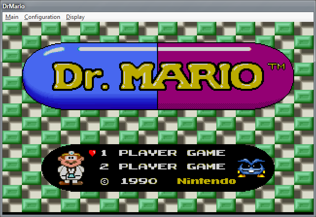
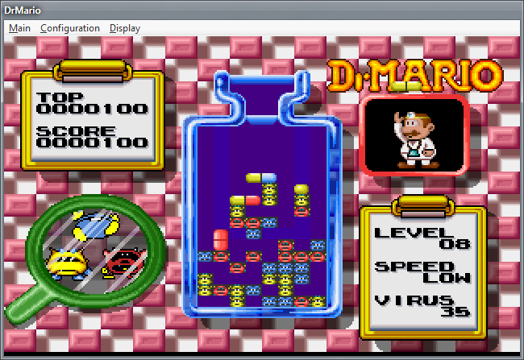
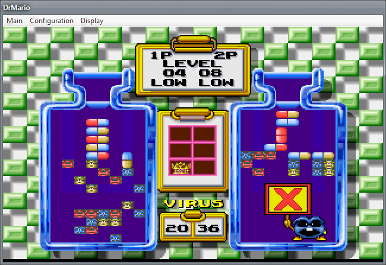

# DrMario

*A playable re-creation of the classic NES game, written 16+ years ago while learning game programming.*

## Background
This is an old project I wrote in the late 90's when I was learning game programming and C.

Back then I realized that *completing* a project was the most difficult task for me. I had this idea of copying an existing NES game that way I would have a ready-made "design document", and I could focus entirely on writing something from start to finish which was a big challenge in and of itself.

There was no intention to "port" the game, to distribute it or profit from it, or even confuse anybody. Almost nobody saw it or played it besides a few of my friends. And of course today there are emulators readily available to play the classic NES game on a PC, so making "port" of the NES game would be totally pointless.

**Why github?** I wrote this 16+ years ago, and I thought I'd upload it as it could be my last backup! It's fun to look back at old code, and the comments I wrote. It's probably not a good idea to modify or build on it though.

## DISCLAIMER

The game is NOT representative of the classic title from Nintendo. It is just my interpretation
from playing the original on an NES. Much of the timing was simply "eye balled". I literally just
counted in my head or used a timer. This was the mid 90's, keep in mind I had no fancy emulators
like we have today.

Therefore all of the graphics were **re-created** entirely by myself using Deluxe Paint on an Amiga 1200. If they look almost identical to the classic NES game or its Super Nintendo version in some places, it's simply because the game was very low res, and it was easy enough to count how many pixels here and there, and make drawings and take notes on squared paper. My reference was playing the game on an actual NES.

Though if you look closely you'll probably find all kind of small differences. For one, I took notes
from a NES version. I first wrote a NES like version in AMOS Basic which was fully functional (albeit a little slow). Later, when I programmed this Windows version, I took inspiration from pictures in a Super Nintendo magazine. (this also explains why the code is bad : I translated my AMOS Basic code almost line by line into C).

The *sounds* (.wav files included in the DRMARIO.WAD data file), I honestly couldn't tell. I didn't
make them, and I have no idea where I found them (remember I made this between 1996-1999, I am
writing this in Sept 2016).

**In summary**:

- I re-created all the graphics by myself. They are not stolen or extracted with emulation or
  anything like that.

- It is NOT  a faithful reproduction of Nintendo's original title and is not intended to deceive. It
  was simply an exercise in programming.

- The original game *Dr. Mario* is of course **Copyright Nintendo**.

- It's old, bad code and today you can emulate NES games quite easily so there is no point at all in forking or modifying this.

- It does not feature any of the advanced levels or secrets or bonuses since I never saw those. I just "ported" the basic gameplay. it does include two player mode though!

## Executable version

A working version is found in the Release/ folder. The game is 269 KB. The WAD file (a resource
file containing the sprites, and sound waves) is 329 KB. The WAD file can be opened and browsed
with old DOOM utilities (it is WAD file format used by DOOM mods).

Surprisingly... the **executable** still works on Windows 7 - 64 bit. I guess because it is using
the really basic DirectDraw API, as well as the standard Windows dialogs. So you can still use
the "Double size" option. The "Fullscreen" option may or may not work.

Next is the README.txt from 16 years ago...

## README.txt

(a basic documentation wrote in 1998-1999 with some light Markdown editing)

DrMario

A Windows95/98 executable, needs DirectX 3 or later.

This is the 95% conversion of Nintendo's classic 'DrMario'.

- The first conversion was made in AMOS Basic on Amiga. Back in 1992 I
  wasn't sure I would be able to write a whole working game in assembler.
  So I wrote the game in basic and then I planned to translate the
  basic code into assembler.

- In 1996, when I began C programming, I translated the whole program
  in C on PC, using the 'Allegro' library for graphics and sound.

- August 1999, I ported DrMario over to WIN32 as an exercise into
  Windows and DirectDraw programming. The source files have a cpp
  extension but the main game code wasn't object oriented at all.

- Lately I have been practising some C++ by rewriting the platform
  dependent code into classes, as presented below.

  *CVideo* - simply instancing this class initializes a virtual screen buffer
  and starts the game in windowed mode or full screen (using DirectDraw).
  Deleting the instance of the class will shutdown the video subsystem,
  free resources and restore the previous display mode if the game was
  running in fullscreen. Pressing Alt+Enter allows to switch between
  full-screen and windowed display modes.

  *CSound* - instancing this class initializes DirectSound, and creates
  a primary output buffer. All you need is then call the ->StartSound()
  method to play waves. On program exit, I just delete the CSound instance to
  stop sounds, and free all the sound sub-system resources.

  *CWad*   - WAD files are simply resource files, I have used the format of Doom
  wad files because then I could use Doom freeware utilities to build the resource
  file. Each instance of the class correspond to a single opened WAD file, resources
  can then be loaded into memory buffers by calling ->ReadEntry().

  *CArgv*  - Create an instance of this class at the beginning of the program to
  parse the command line arguments. Command line arguments are not meant
  for the user really, but they can be useful during the development.

  *CLogFile* - a really basic class that once instantiated, opens a text file, and
  appends debugging output to it.

